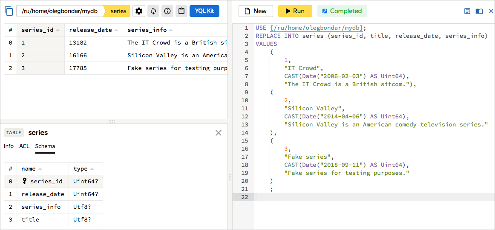
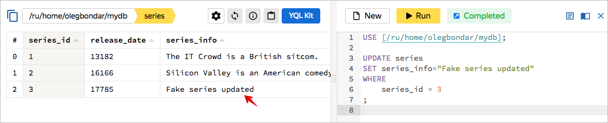
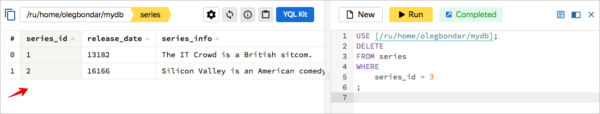
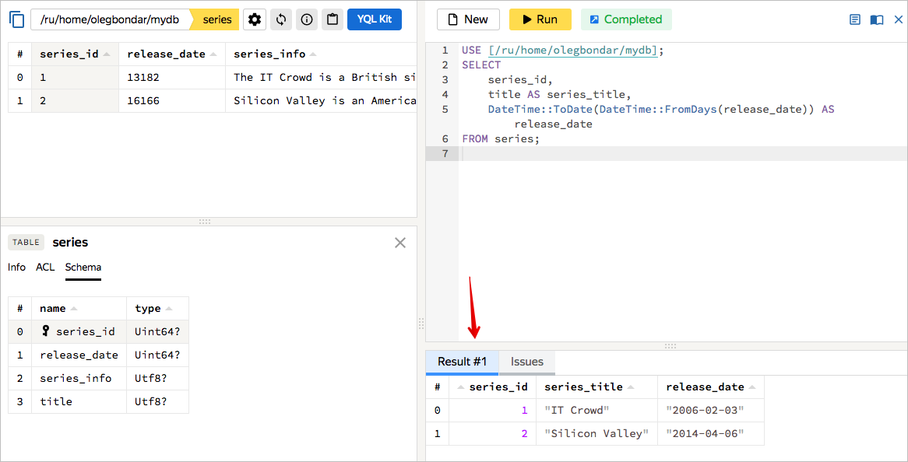

# Работа с данными через консоль управления

После [создания базы данных](../create-db.md) выполните базовые YQL-запросы используя консоль управления {{ yandex-cloud }}.



Подробнее о синтаксисе YQL читайте в [Справочнике YQL](../../yql/reference/overview.md).



## Создайте таблицу {#create-table}

Создайте таблицу в БД с помощью инструкции [CREATE TABLE](../../yql/reference/syntax/create_table.md):



- Консоль управления

  



## Добавьте данные {#replace-data}

Добавьте данные в таблицу, используя инструкцию [REPLACE INTO](../../yql/reference/syntax/replace_into.md):



- Консоль управления

  







## Измените данные {#update-data}

Измените существующие данные в таблице, используя инструкцию [UPDATE](../../yql/reference/syntax/update.md):



- Консоль управления

  







## Удалите данные {#delete-data}

Удалите данные из таблицы с помощью инструкции [DELETE](../../yql/reference/syntax/delete.md):



- Консоль управления

  







## Запросите данные {#select-data}

Запросите данные из таблицы с помощью инструкции [SELECT](../../yql/reference/syntax/select.md):



- Консоль управления

  







## Удалите таблицу {#drop-table}

Удалите таблицу с помощью инструкции [DROP TABLE](../../yql/reference/syntax/drop_table.md):



- Консоль управления

  


