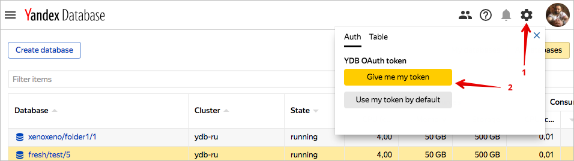

# Управление доступом в Yandex Database



В YDB используется аутентификация на основе токенов, которые пересылаются пользователем вместе с запросом.

## Аутентификация {#authentication}

### Консоль управления {#web-ui}

В [веб-интерфейсе](https://ydb.yandex-team.ru/) для [аутентификации](../concepts/iam.md) используются cookies пользователя в домене yandex-team.ru (проверка через blackbox). Пользователь консоли управления аутентифицируется автоматически, не требуется совершать дополнительные действия для аутентификации.

### OAuth токен для использования в приложении {#oath-app}

Для аутентификации при обращении к БД в YDB из приложения понадобится OAuth токен.

* Для того, чтобы получить персональный токен, следует нажать на иконку шестеренки в [веб-интерфейсе](https://ydb.yandex-team.ru/), после чего нажать на кнопку "Give me my token". Полученный в результате персональный токен можно использовать в приложении.
* Для того, чтобы использовать роботного пользователя для доступа к БД потребуется:
    * получить для робота OAuth токен (подойдёт YQL токен);
    * [сообщить](https://st.yandex-team.ru/createTicket?template=1918&queue=YDBREQUESTS) логин робота и название базы, чтобы администратор системы выдал созданному роботу корректные права доступа к базе.

### OAuth токен для использования в консоли управления {#oath-ui}

Возможно использование OAuth токена вместо cookies в [веб-интерфейсе YDB](https://ydb.yandex-team.ru/). Чтобы для аутентификации по умолчанию использовался OAuth токен следует нажать на кнопку "Use my token by default" (см. рисунок выше).

## Авторизация {#authorization}

Пользователю, инициировавшему создание БД выдаются права *use*.

Права *use* дают возможность:

* создавать и удалять таблицы и директории в БД;
* выполнять операции чтения и записи над данными и атрибутами схемы;
* выдавать права доступа другим пользователям, но только в рамках перечисленных выше прав *use*.

Управление правами в текущей версии возможно только через [С++](https://a.yandex-team.ru/arc/trunk/arcadia/kikimr/public/sdk/cpp/client/ydb_scheme.h) и [Python](https://a.yandex-team.ru/arc/trunk/arcadia/kikimr/public/sdk/python/client/scheme.py) SDK, которые содержат методы предоставления, отзыва, изменения выданного списка прав, а также метод смены владельца таблицы, директории или БД.

Пользователь не может самостоятельно изменять параметры БД или удалять БД. В текущей версии эти действия может совершить только  администратор системы.

Для изменения параметров БД следует заполнить [форму](https://st.yandex-team.ru/createTicket?template=1918&queue=YDBREQUESTS).

Для удаления БД следует заполнить [форму](https://st.yandex-team.ru/createTicket?template=1919&queue=YDBREQUESTS).



Пользователь Yandex.Cloud может выполнять только те операции над ресурсами, которые разрешены назначенными ему ролями. Пока у пользователя нет никаких ролей, почти все операции ему запрещены.

Чтобы разрешить доступ к ресурсам сервиса YDB (базы данных и их пользователи), назначьте пользователю нужные роли из приведенного ниже списка. На данный момент роль может быть назначена только на родительский ресурс (каталог или облако), роли которого наследуются вложенными ресурсами.




Подробнее о наследовании ролей читайте в разделе [{#T}](../../resource-manager/concepts/resources-hierarchy.md#access-rights-inheritance) документации сервиса Yandex Resource Manager.




## Назначение ролей {#grant-roles}

Чтобы назначить пользователю роль:





## Роли {#roles}

Ниже перечислены все роли, которые учитываются при проверке прав доступа в сервисе YDB.





### ydb.viewer

Пользователь с ролью `ydb.viewer` может выполнять следующие действия:

* устанавливать соединения c БД;
* просматривать список схемных объектов (таблиц, индексов и каталогов);
* просматривать описание схемных объектов (таблиц, индексов и каталогов);
* просматривать информацию о БД;
* выполнять запросы на чтение данных.

Также пользователю с данной ролью доступно получение списка каталогов в облаке и списка ресурсов в каталоге облака.

Все полномочия роли `ydb.viewer` включены в состав роли `viewer`.

### ydb.editor

Пользователь с ролью `ydb.editor` может выполнять следующие действия:

* управлять БД, например создать БД или изменить ее параметры;
* создавать, изменять и удалять объекты схемы в БД (таблицы, индексы и каталоги);
* выполнять запросы на запись данных.

Помимо этого роль `ydb.editor` включает в себя все разрешения роли `viewer`.

Все полномочия роли `ydb.editor` включены в состав роли `editor`.

### ydb.admin

Состав полномочий роли `ydb.admin` идентичен составу полномочий роли `ydb.editor`.

### viewer

Пользователь с ролью `viewer` может просматривать информацию о ресурсах, например посмотреть список хостов или получить информацию о кластере БД.

### editor

Пользователь с ролью `editor` может управлять любыми ресурсами, например создать кластер БД, создать или удалить хост в кластере.

Помимо этого роль `editor` включает в себя все разрешения роли `viewer`.

### admin

Пользователь с ролью `admin` может управлять правами доступа к ресурсам, например разрешить другим пользователям создавать кластеры БД или просматривать информацию о них.

Помимо этого роль `admin` включает в себя все разрешения роли `editor`.


