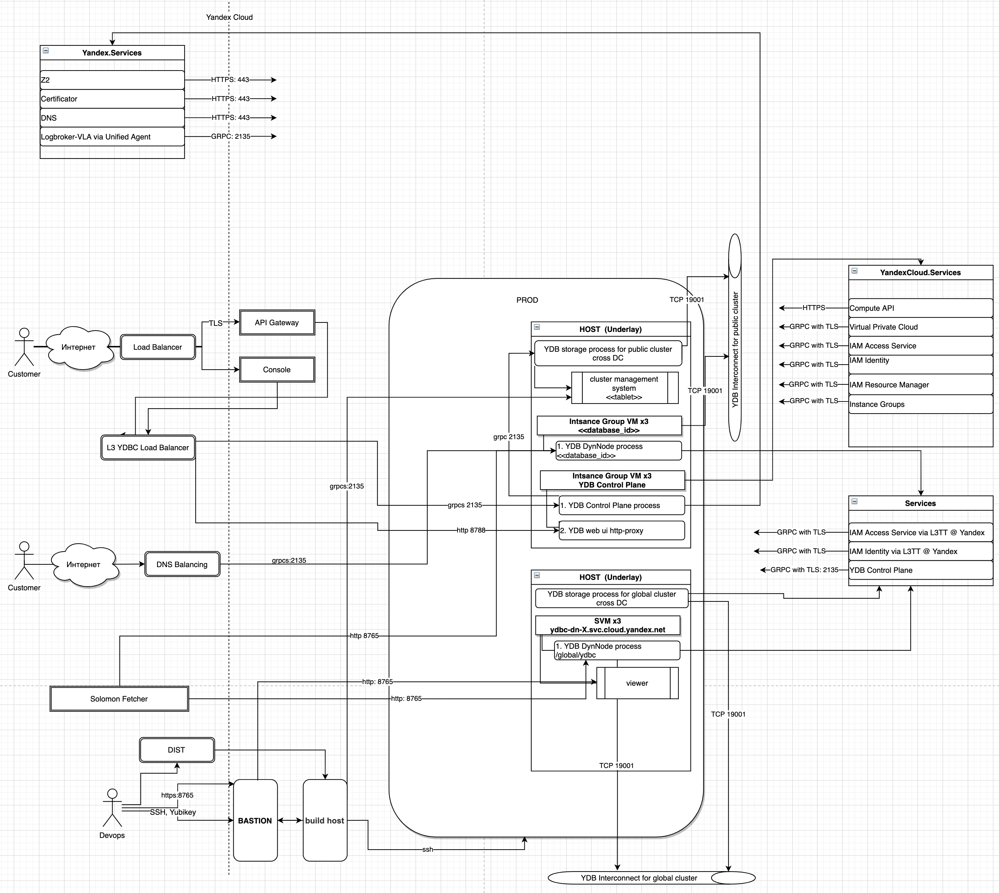
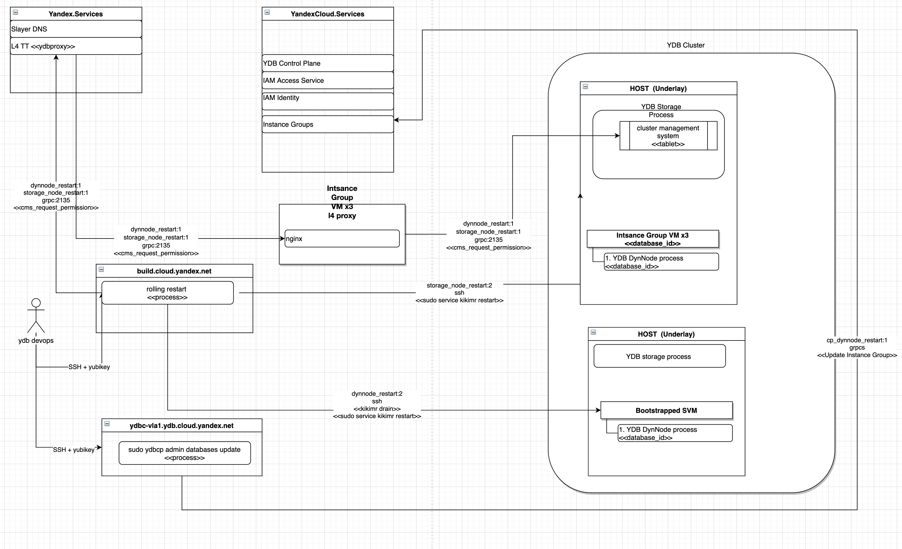
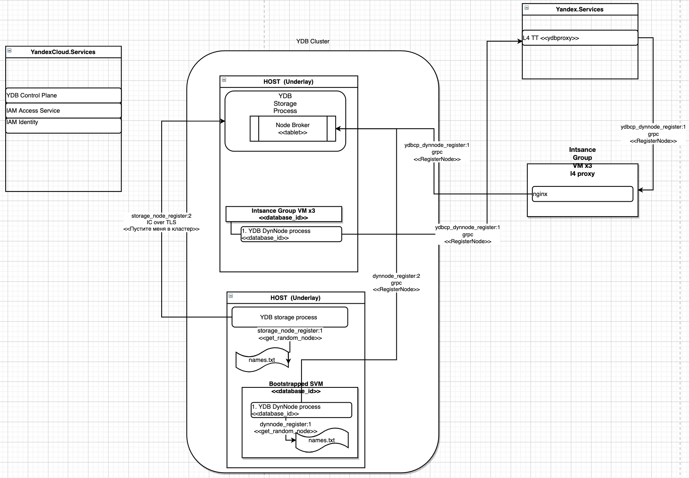
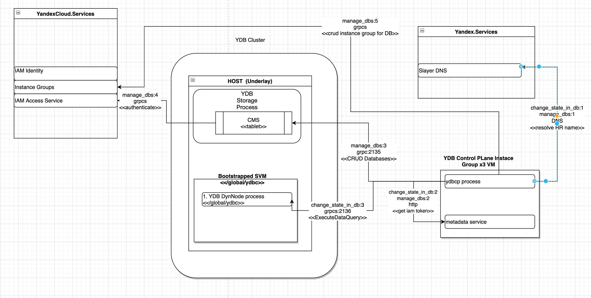
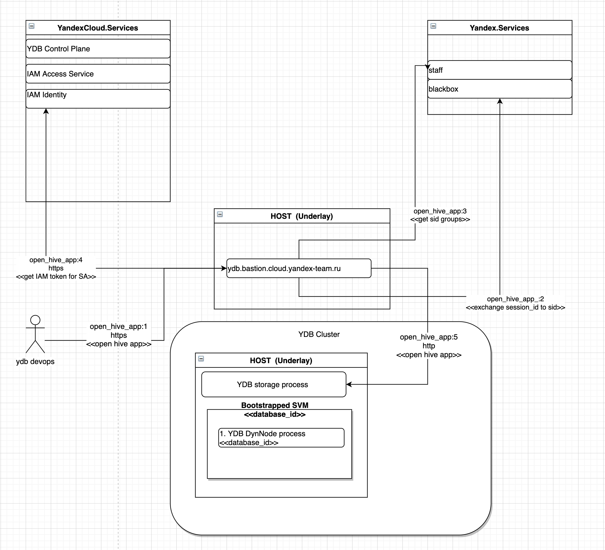

# Сценарии взаимодействия компонентов

В разделе приведены сценарии взаимодействия компонентов кластера YDB. Основная цель раздела: проиллюстрировать взаимодействие компонентов в контексте авторизации и аутентификации.

Рассмотрены сценарии:

1. Проверка состояния системы
1. Rolling restart процессов кластера
1. Регистрация ноды в кластере
1. Взаимодействие YDB Control Plane с кластером
1. Взаимодействие с вьюером через бастион



Рисунки, приведённые в этом разделе, получены из диаграмм, нарисованных в [draw.io](https://drawio.yandex-team.ru/). Исходник сохранён в Аркадии по адресу [https://a.yandex-team.ru/arc/trunk/arcadia/kikimr/docs/ru/_assets/dfd_yc_ydbaas_auth.drawio](https://a.yandex-team.ru/arc/trunk/arcadia/kikimr/docs/ru/_assets/dfd_yc_ydbaas_auth.drawio).



## Общий вид

На рисунке 1 приведён общий вид размещения компонентов YDB в облаке.
Эту схему демонстрируют аудиторам по ИБ.

<small>Рисунок 1 — Общий вид</small>

## Проверки

Типы проверок:

* проверки SLO – по результатам их выполнения оценивается соответствие доступности баз в кластере согласованному SLO. Процессы, выполняющие проверки, запускаются в виртуальных машинах под управлением инстанс группы, выполняют запросы во все базы данных кластера через public api, имитируя простое приложение;
* кластерные джаглерные проверки – проверяют состояние кластера в целом, запускаются в виртуальных машинах под управлением инстанс группы;
* похостовые дажглерные проверки – проверяют состояние определённой ноды кластера, запускаются на каждой ноде кластера.

### Проверки SLO

Проверки SLO запускаются на виртуальных машинах под управлением инстанс группы. Подробней устройство проверок описано на [вики](https://wiki.yandex-team.ru/kikimr/developers/oncall/oncall/ydb-slo/).
Проверки выполняются от имени сервисных акаунтов:

* preprod – `bfbohb360qqqql1ef604`;
* prod – `ajemhs2mvetqevrk4tcv`.

Чтобы у этих сервисных акаунтов была возможность выполнять запросы ко всем базам в кластерах облака, им выдана специальная роль `ydb.sloChecker` в IAM. Подробней в [тикете](https://st.yandex-team.ru/CLOUD-41179).

### Похостовые проверки

Список похостовых проверок:

* ydb_service - обращается к http-viewer;
* ydb_pool - обращается к http-viewer;
* ydb_disk - обращается к http-viewer.

Похостовые проверки запускаются на:

* виртуальных машинах, созданных бутстрапом;
* сторадж нодах.

В виртуалках, созданных контрол плейном, похостовые проверки не запускаются. Причина: нет возможности создать агрегат для джаглера. Нет интеграции джаглера с инстанс-группами.

Для аутентификации похостовые проверки при запуске в виртуальных машинах получают токен из сервиса метаданных. При запуске на сторадж нодах получают IAM-токена в Token Service в обмен на ключи доступа, доставленные через Secret Service.

### Кластерные проверки

Список кластерных проверок

* ydb_storage - обращается к http-viewer;
* ydb_pdisk_free_space - обращается к http-viewer;
* ydb_tablet_health - обращается к http-viewer;
* ydb_pdisk_broken - обращается к http-viewer и к legacy grpc api.



* от имени какого пользователя на сторадж нодах проверки ходят в YDB?
* как получают токен?
* какие проверки из джаглерной вм ходят в http, а какие - в grpc?
* а зачем мы выехали из сторадж нод в виртуалки? в чём был профит, учитывая, что что-то осталось на сторадж нодах всё равно?
* почему slo check. пускают в каждую базу? как устроен хитрый IAM - пермишен?



На рисунке 2 показана схема взаимодействия компонентов при выполнении проверок определённого типа. Последовательность взаимодействия проиллюстрирована цифрами в подписях к стрелкам.

<small>Рисунок 2 — Проверки</small>

Адреса L4 балансеров для каждого из кластеров облака перечислены на [вики](https://wiki.yandex-team.ru/users/landavid/ydb-l4-proxy/).

## Rolling restart процессов кластера {#rolling_restart}

Rolling restart нужен для перезапуска всех процессов кластера с минимальным негативным эффектом для пользовательских приложений. Перезапуск может быть средством для обновления версии или применения настроек, требующих перезапуска. Существует два вида роллинг рестарта:
* ролинг-рестарт стораджёвых нод;
* ролинг-рестарт диннод, созданных бутстрапом.

Динноды, работающие под управлением контрол-плейна, обновляются с помощью постепенного пересоздания виртуальных машин из образа с нужными версиями требуемых артефактов. Пересоздание выполняется средставми инстанс групп.



Ролинг рестарт нужен только для перезапуска. Доставка и установка артефактов требуемых версий осуществляется с помощью Z2.



На рисунке 3 показана схема взаимодействия компонетов при выполнении трёх видов ролинг рестарта.

<small>Рисунок 3 — Rolling restart</small>

## Регистрация ноды в кластере

В результате регистрации ноды в кластере нода получает идентификатор NodeId и входит в [Interconnect](../internals/interconnect.md).

Для нод в кластерах Yandex.Cloud можно выделить три способа вхождения в кластер:

* динноды в виртуальных машинах, запущенных через control plane, получают NodeId, выполняя вызов `RegisterNode` в YDB Legacy API через L4-балансер, собранный облачной командой infra;
* динноды в виртуальных машинах, запущенных через boostrap, получают NodeId, выполняя вызов `RegisterNode` в YDB Legacy API к одной из нод кластера, перечисленных в файле `names.txt`;
* сторадж ноды входят в Interconnnect, устанавливая соединение с нужными нодами кластера из списка в файле `names.txt`.

Вызов `RegisterNode` имеет право выполнить субъект, указанный в файле `domains.txt` в параметре `AdministrationAllowedSIDs`.

На рисунке 4 показана схема регистрации в кластере разных типов нод.

<small>Рисунок 3 — Регистрация ноды в кластере</small>

## Взаимодействие YDB Control Plane с кластером

YDB Control Plane – это приложение, которое реализует gRPC API создания, обновления и управления базами YDB. Подробно [описан на вики](https://wiki.yandex-team.ru/kikimr/developers/ydbcp/). Контрол плейн взаимодействует с кластерами YDB для:
* управления базами данных на определённом кластере, один контрол плейн может взаимодействовать с несколькими кластерами;
* доступа к данным о состоянии контрол плейна, которые хранятся в базе YDB в глобальном кластере соответствующего кластера Yandex.Cloud.

В каждом кластере Yandex.Cloud (препрод, прод) запущен отдельный экземпляр контрол плейна. Контрол плейн может управлять базами в кластерах:
* `global` – кластер, предназначенный для сервисных баз Yandex.Cloud;
* `public` – кластер для баз внешних пользоваталей сервиса YDB as a Service в Yandex.Cloud.

Control Plane взаимодействует с кластерами YDB от имени следующих сервисных акаунтов:

* prod – `aje1v506u80hu5hh7b0e`;
* preprod - `bfboqmsftn8g3rhbej62`.

Актуальные идентификаторы сервисных акаунтов следует искать в конфигах в Аркадии для [прода](https://a.yandex-team.ru/arc/trunk/arcadia/kikimr/ydbcp/configs/prod/config.yaml) и [препрода](https://a.yandex-team.ru/arc/trunk/arcadia/kikimr/ydbcp/configs/preprod/config.yaml).

Чтобы пользователь, от имени которого работает Control Plane, имел право создания/удаления баз данных, необходимо:
* SID этого пользователя должен быть указан в файле `domains.txt` в параметре `AdministrationAllowedSIDs`;
* пользователю должны быть выданы полные права на корневой домен кластера.

Control Plane хранит свои данные в базе YDB c именем `ydbc` в глобальном кластере YDB. С базой контрол плейн взаимодействует от имени сервисного акаунта. Для аутентификации и авторизации доступа к базе контрол плейна применяется стандартная облачная схема.

На рисунке 4 схематично показан процесс взаимодействия YDB Control plane с кластером YDB для выполнения операций создания, получения описания, изменения и удаления базы данных.

<small>Рисунок 4 — Взаимодействие Control Plane с кластером</small>

## Взаимодействие с вьюером через бастион

Чтобы ограничить доступ ко встроенному в YDB вьюеру и аутентифицировать пользователей, в Yandex.Cloud сделали L7-бастион. Подробней его устройство описано автором на [вики](https://wiki.yandex-team.ru/cloud/security/services/l7proxy/bastion-l7-proxy/). Процессы бастиона работают на особых железных хостах, на которых не может быть виртуальных машин пользоваталей.

L7-бастион проксирует запросы по https из сетей Яндекса в Yandex.Cloud в конкретные вьюеры на нодах кластеров YDB. При этом бастион по сессионной куке от внутреннего паспорта аутентифицирует пользователя и авторизует его доступ ко вьюеру. Доступ ко вьюерам через бастион разрешён участникам abc-сервисов, перечисленных в [конфиге](https://bb.yandex-team.ru/projects/CLOUD/repos/securitytools/browse/bastion/salt/formula/bastion-auth/files/config.yaml.j2#189).

При обращении ко вьюеру бастион передаёт IAM-токен сервисного пользователя. SID этого пользователя должен быть вписан в файле `domains.txt` в параметр `MonitoringAllowedSIDs`.

Сервисные пользователи, которых использует бастион, созданы в облаке yc-ydbaas в [папке dynnodes](https://console.cloud.yandex.ru/folders/b1g8g02cegpoen3nd5m8?section=service-accounts). Ниже указаны их идентификаторы:

* prod - `aje1jl06csudue8356ip`;
* preprod - `bfb6v2jaqevkeqf0u81q`;



Предполагалось, что процесс kikimr будет слушать по http на localhost:8765. Рядом с каждым процессом kikimr будет запущен nginx, принимающий входящие https-соединения на внешнем интерфейсе на порту 8765 и проксирующий их по http на localhost:8765.
Схема до конца ни на одном кластере облака не реализована.



На рисунке 5 схематично показан процесс взаимодействия компонентов в процессе обращения к странице хайва во вьюере на произвольном кластере YDB в облаке через бастион.

<small>Рисунок 5 — Схема доступа ко вьюеру через бастион</small>
