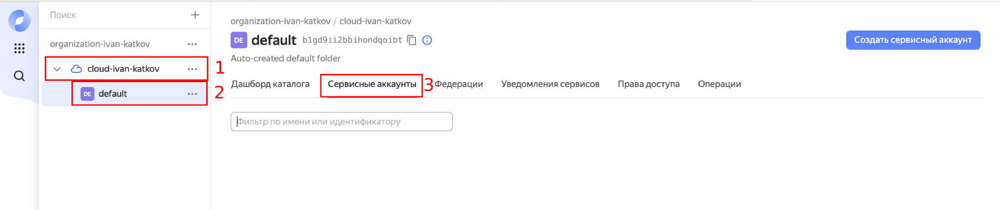
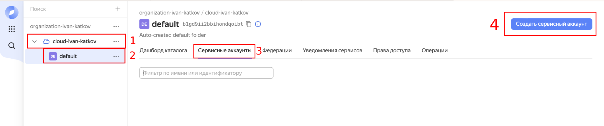
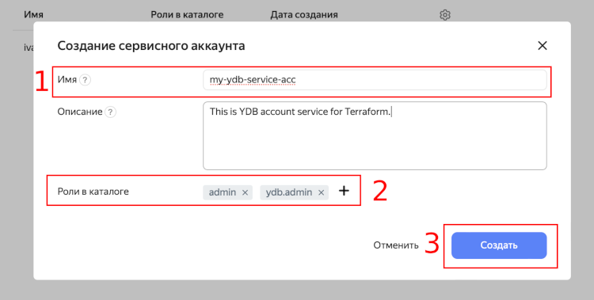
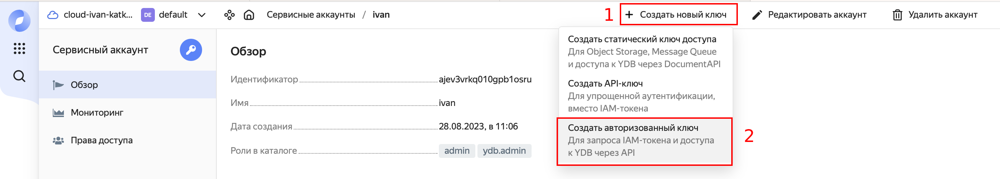
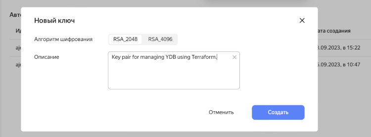
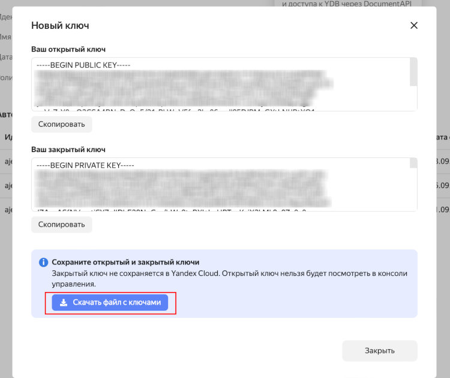

# Получение данных для аутентификации {#get-auth-credos}

Чтобы аутентифицироваться в {{ yandex-cloud }} и управлять базами данных YDB с помощью Terraform можно использовать [сервисный аккаунт](../../iam/concepts/users/service-accounts.md), [аккаунта на Яндексе](../../iam/concepts/index.md#passport) или [федеративный аккаунт](../../iam/concepts/index.md#saml-federation). Также для аутентификации и работы Terraform с YDB понадобится интерфейс командной строки Yandex Cloud. Если у вас еще нет yc — установите его, следуя [инструкции](../../cli/quickstart.md#install).

Сервисный аккаунт можно создать и настроить, следуя следующей инструкции:
1. В консоли управления выберите каталог, в котором хотите создать сервисный аккаунт.

<br/>

2. На вкладке **Сервисные аккаунты** нажмите кнопку `Создать сервисный аккаунт`.

<br/>

3. Введите имя сервисного аккаунта:
    * Длина имени — от 3 до 63 символов;
    * Имя может содержать строчные буквы латинского алфавита, цифры и дефисы;
    * Первым символом имени должна быть буква, а последним символом не должен быть дефис.
4. Назначьте сервисному аккаунту роли, необходимые для управления ресурсами YDB: `admin`, `ydb.admin`.


5. Нажмите кнопку **Создать**.

Перейдите в **Сервисный аккаунт** и создайте авторизованный ключ для аутентификации Terraform в {{ yandex-cloud }}:
1. Нажмите на кнопку `Создать новый ключ` и выберете пункт `Создать авторизованный ключ`.

<br/>

2. Введите **Описание ключа** (опционально) и нажмите кнопку **Создать**. 

<br/>

3. Нажмите кнопку **Скачать файл с ключом** к себе на локальную машину.

<br/>

Теперь, последний шаг по настройке аутентификации — создание специального профиля для подключения к {{ yandex-cloud }} на локальной машине с помощью yc CLI. 

Выполните следующие команды:
1. Создайте профиль `yc` для выполнения операций от имени сервисного аккаунта. Укажите имя профиля: `yc config profile create <имя_профиля>`. В терминал будет выведено следующие сообщение: `Profile '<имя_профиля>' created and activated.`
2. Задайте конфигурацию профиля следующими командами:
    ```bash
    yc config set service-account-key <загруженный ключ в формате json>
    yc config set cloud-id <идентификатор облака>
    yc config set folder-id <идентификатор каталога>
    ```

Описание значения параметров команд:
* `service-account-key` — файл с авторизованным ключом сервисного аккаунта.
* `cloud-id` — [идентификатор облака](../../resource-manager/operations/cloud/get-id.md).
* `folder-id` — [идентификатор каталога](../../resource-manager/operations/folder/get-id.md).

Добавьте аутентификационные данные в переменные окружения:

- Bash
    ```bash
    export YC_TOKEN=$(yc iam create-token)
    export YC_CLOUD_ID=$(yc config get cloud-id)
    export YC_FOLDER_ID=$(yc config get folder-id)
    ```
    
- PowerShell
    ```powershell
    $Env:YC_TOKEN=$(yc iam create-token)
    $Env:YC_CLOUD_ID=$(yc config get cloud-id)
    $Env:YC_FOLDER_ID=$(yc config get folder-id)
    ```
    

Terraform будет использовать заданные переменные окружения для аутентификации, поэтому нужно обратить внимание на то, что время жизни `IAM-токена` не более 12 часов. После истечения времени жизни токена, Terraform будет выдавать ошибку аутентификации. В таком случае нужно обновить переменную окружения – выполнить повторно команду export `YC_TOKEN=$(yc iam create-token)`. 

Процесс получения нового токена можно автоматизировать с помощью `crontab`: введите `crontab -e` и введите `0 * * * * export YC_TOKEN=$(yc iam create-token)`. Теперь `crontab` будет самостоятельно каждый час обновлять токен в рамках текущей сессии, а чтобы токен обновлялся при открытии новой сессии нужно выполнить одну из команд:
```bash
echo "export YC_TOKEN=$(yc iam create-token)" >> ~/.bashrc # Команда для bash оболочки
echo "export YC_TOKEN=$(yc iam create-token)" >> ~/.zshrc # Команда для zsh оболочки
```

На этом настройка аутентификации закончена. Можно [устанавливать и настраивать](./install.md) Terraform.