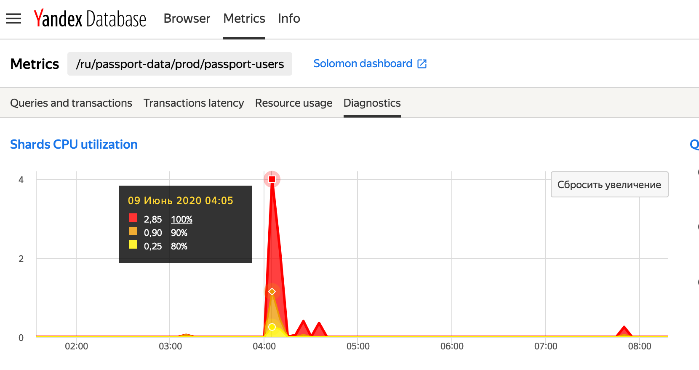
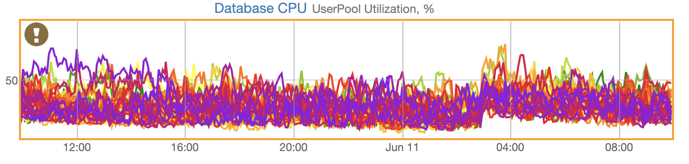
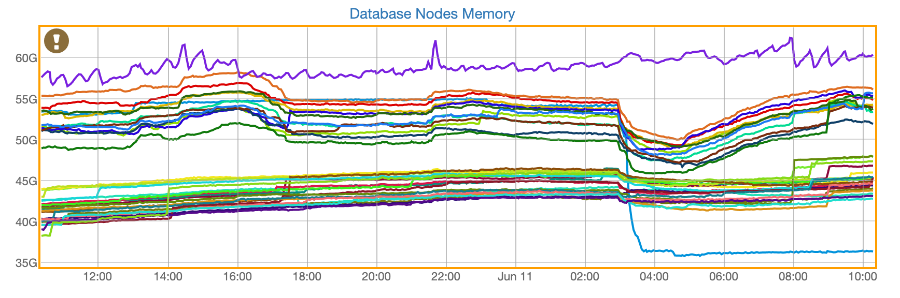

# Использование диагностического дашборда

В разделе приведены рецепты диагностики типовых проблем в работе базы данных. Для диагностики используются графики, собранные на [диагностическом дашборде в Соломоне](../maintenance/monitoring.md#diagnostics).

## Поиск шардов c повышенным потреблением CPU {#overloaded-shards}

Как правило, в обработке каждого запроса к базе данных участвуют один или больше _шардов_ таблиц. Подробнее про [шардирование таблиц](../oss/public/develop/concepts/datamodel#sharding) можно узнать из раздела [Модель данных и схема](../concepts/datamodel.md).

_Шард_ спроектирован для однопоточной обработки запросов. Поэтому каждому _шарду_ доступно не более одного ядра. Нагрузка, приводящая к потребленияю выделенного ядра на 90% и более процентов может приводить к ухудшению времени выполнения запросов. На графике CPU Utilization [диагностического дашборда](../maintenance/monitoring.md#diagnostics) показано количество _шардов_ таблиц, загрузка которых превысила 70%. Количество _шардов_ разложено по корзинам в соответствии с мгновенным потреблением выделенного ядра:

* 70% - 80%;
* 80% - 90%;
* 90% - 100%.

На рисунке 1 показан примерный вид графика CPU Utilization для базы с перегруженными _шардами_



<small>Рисунок 1 — примерный вид графика использования CPU _шардами_ таблиц базы</small>

На вертикальной оси графика отмечено количество _шардов_ с повышенным потреблением CPU в соответствующий момент времени.

Из графика видно, что около 04:05 в рассматриваемой базе данных было несколько _шардов_, попавших в корзину 90% - 100% по использованию CPU.

Повышенное (больше 90%) потребление CPU _шардом_, свидетельствует о близости потока запросов к максимальной пропусной способности _шарда_. Такая ситуация может привести к росту времени выполнения запросов к базе и росту очередей выполнения запросов.

Размеры очередей запросов в системе ограничены, в разделе [Размеры очередей](diag_dashboard.md#queues) приведены значения действующих ограничений и рекомендации по мониторингу. После достижения установленного ограничения, все запросы с участием перегруженных _шардов_ будут заканчиваться ошибкой.



Ситуации повышенного потребления CPU _шардами_ критична и требует скорейшего разбирательства. Ниже описан способ поиска перегруженного _шарда_.



### Как найти перегруженный шард

Уникальный идентификатор перегруженного _шарда_ и имя таблицы, к которой он относится, можно найти поиском по логам базы YDB.

Логи процессов, обслуживающих базы данных на [кластерах YDB](../concepts/clusters.md), централизованно собираются и доставляются в YDB для хранения.

Для поиска по логам базы следует модифицировать пример YQL-запроса, приведённый ниже.

* [yql-операция](https://yql.yandex-team.ru/Operations/X3Ixmy--PDVZXAYWjkwIHpzPDEyOpUNVWUv2x4hz4U0=);

Текст шаблона YQL запроса показан на листинге 1.
```sql
/**
* Change $database parameter value to full path to your database
*/
$database = '/ru-prestable/tutorial/home/testdb';

/**
* Change $days_ago parameter value to define the timeframe for log records to be searched.
*/
$days_ago = 1;

SELECT DISTINCT
  table_name,
  shard_id,
FROM
    `/ru-prestable/ydb/prod/logs/processed_logs/overloaded_shards`
WHERE
    event_time > CurrentUtcDatetime() - DateTime::IntervalFromDays($days_ago)
AND
    table_name LIKE $database || '/%'
```

<small>Листинг 1 — Шаблон YQL-операции для поиска перегруженных _шардов_.</small>


Для выполнения запроса нужно присвоить переменной `$database` значение, соответствующее полному имени базы данных, в которой обнаружены перегруженные _шарды_.

В результате выполнения запроса в случае наличия в логах записей о перегруженных _шардах_, будет сформирован результат с перечисленными ниже столбцами:

* table_name – полный путь к таблице, _шард_ которой был перегружен;
* shard_id – уникальный идентификатор _шарда_.

### Типичные причины перегрузки

**Большие выборки**

При выполнении YQL-запроса _шарды_ таблиц YDB читают данные с [групп хранения](../concepts/databases#storage-groups) и выполняют вычисления. Для каждого _шарда_ существует максимальная пропускная способность, которую можно измерить в количестве прочитанных строк в единицу времени. Ситуации, в которых на _шард_ поступает поток запросов, близкий к его пропускной способности, приводят к высокому потреблению CPU _шардом_. Таких ситуаций следует избегать.

К наибольшему потреблениею CPU приводят запросы, не использующие индексы и просматриваюшие все строки таблицы. Количество ресурсов и времени, необходимое для выполнения такого запроса, растёт линейно или круче с ростом количества строк в таблице.

Чтобы убедиться в отсутствии запросов, нагружающих _шарды_ таблицы выборками, просматривающими большое (от десятков тысяч) количество строк, можно воспользоваться следующим алгоритмом:

1. Найти таблицу с перегруженными шардами.
1. С помощью [системных таблиц](system_views.md) определить скорость чтения для данной таблицы, пример запроса приведён на листинге 2.
1. Проанализировать запросы к этой таблице: убедиться, что нет запросов, сканирующих все строки и запросов, читающих большие диапазоны (больше тысячи строк).

Подробнее анализ плана выполнения запросов описан в разделе [Использование консольного клиента YDB](../getting_started/ydb_cli.md#explain_plan).

```sql
use ydb_ch;

SELECT
    Path,
    PartIdx,
    RangeReadRows,
    RowReads,
    RowCount,
    cast(RangeReadRows/RowCount as UInt64) as AvgRangeReadPerRow,
    cast((RowReads / RowCount) as UInt64) as AvgReadPerRow,
    cast((RangeReadRows + RowReads) / (toUnixTimestamp(now()) - StartTime/1000000) as UInt64) as ReadRowsPerSecond
FROM
    ydbTable('ru-prestable', '/ru-prestable/metrika/testing/visits', '.sys/partition_stats')
ORDER BY RangeReadRows DESC
LIMIT 20
```
<small>Листинг 2 — Пример запроса для оценки количества читаемых шардами строк.</small>

В случае обнаружения запросов, сканирующие все строки таблицы или слишком большие диапазоны, следует переработать такие запросы.

**Горячий шард**

Высокое потребление CPU шардом таблицы может быть связано с тем, что все записи попадают в один _шард_. Это может быть вызвано неоптимальным выбором первичного ключа. Например, в случае монотонного возрастания его значений, все записи будут попадать в последний _шард_. Рекомендации по проектированию первичного ключа читайте в  [документации](https://cloud.yandex.ru/docs/ydb/oss/public/develop/best_practices/schema_design).

## Нехватка CPU {#cpu-shortage}

На рисунке 2 приведён пример графика User Pool CPU Utilization %, показывающий долю использованию CPU, выделенного процессам базы для обработки пользовательских запросов. Потребление каждого процесса на графике показано отдельной линией. При утилизации каким-либо из процессов больше 80% выделенного CPU возможны ухудшения во времени обработки запросов.



<small>Рисунок 2 — примерный вид графика использования CPU в UserPool процессами базы</small>

Если у базы данных наблюдается систематический недостаток CPU, следует оформить [заявку на квоту](../concepts/quotas_and_limits.md#request_qouta) в YDB и на изменение конфигурации базы [с помощью формы](https://forms.yandex-team.ru/surveys/30510/).

## Нехватка памяти {#memory-shortage}

На рисунке 3 показан примерный вид графика выделения памяти процессами, обслуживающими базу данных. Размер памяти, доступной процессу, обслуживающему базу, ограничен и составляет 50 Гб. На этот график стоит обратить внимание, если на нём наблюдаются регулярные падения линий до нуля и резкий рост. Такой график с высокой вероятностью иллюстрирует нехватку памяти, приводящую к принудительному завершению процесса базы из-за превышения допустимого размера выделенной памяти.



<small>Рисунок 3 — примерный вид графика выделения памяти процессами базы</small>

Частые перезапуски процессов, обслуживающих базу, приведут к росту доли [ошибочных ответов](https://cloud.yandex.ru/docs/ydb/oss/public/reference/ydb-sdk/error_handling#termination-statuses) `Unavailable`, что в свою очередь приведёт к росту доли ошибок в ответах приложения пользователю или к росту времени выполнения запросов.

Одной из возможных причин выского потребления памяти могут быть запросы к базе, читающие много данных. Пример запроса к системным таблицам, который выводит top запросов по размеру прочитанных данных, приведён на листинге 3.

```sql
use ydb_ch;

SELECT
    QueryText,
    ReadBytes/10000000 as ReadMegabytes
FROM
    ydbTable('ru-prestable', '/ru-prestable/tutorial/home/testdb', '.sys/top_queries_by_read_bytes_one_hour')
ORDER BY ReadBytes DESC
LIMIT 20
```
<small>Листинг 3 — Пример запроса к системным  таблицам для поиска  запросов, читающих больше всех данных.</small>

В результате выполнения запроса к системным таблицам могут быть обнаружены запросы к базе, читающие больше сотен мегабайт данных. Стоит исследовать такие запросы. Начать исследование стоит с изучения плана запроса, построить который можно с помощью [консольного клиента ydb](../getting_started/ydb_cli.md#explain_plan)

Если у базы данных наблюдается систематический недостаток доступной памяти, следует увеличить количество [вычислительных ресурсов](../concepts/databases.md#compute-units), доступных базе. Для этого нужно оформить [заявку на квоту](../concepts/quotas_and_limits.md#request_qouta) в YDB и на изменение конфигурации базы [с помощью формы](https://forms.yandex-team.ru/surveys/30510/).

## Запросы, закончившиеся ошибкой {#request-errors}

На диагностическом дашборде количество запросов в единицу времени, закончившихся ошибкой, можно определить по двум графикам:

* Query Error Responses – Hard Errors (Non-Retriable) - отображает ошибки, в ответ на которые нельзя повторять запрос и следует найти и устранить причину возникновения ошибки;
* Query Error Responses – Soft Errors (Retriable) - отображает ошибки, в ответ на которые приложению следует повторит запрос с выбранной политикой задержки.

Подробно коды ответов, возвращаемые в результате выполнения запроса, описаны в [документации](https://cloud.yandex.ru/docs/ydb/oss/public/reference/ydb-sdk/error_handling).

## Блокировки {#locks}

На графике Transaction Locks Invalidation отображено количество транзакций в секунду, выполнение которых закончилось ошибкой `Transaction locks invalidated`, (TLI) – являющейся результатом нарушения [оптимистических блокировок](https://en.wikipedia.org/wiki/Optimistic_concurrency_control). Доступные режимы транзакций и блокировки смотрите в [документации](https://cloud.yandex.ru/docs/ydb/oss/public/develop/concepts/transactions).

Ситуации, в которых доля запросов, закончившихся ошибкой `Transaction locks invalidated`, превышает доли процента, свидетельствуем о неправильном подходе к применению транзакций в приложении и требует улучшения. Для поиска причины высокой доли нарушения блокировок можно воспользоваться следующим алгоритмом:

1. Записывать в логи на стороне приложения полный текст ошибки, возвращаемый YDB в ответ на запрос, закончившийся ошибкой `Transaction locks invalidated`. В Issues, возвращаемых с таким ответом, будет указано имя таблицы, нарушение блокировок на которой привело к ошибке.
2. После определения таблиц, транзакции над которыми завершаются ошибкой наиболее часто, следует изучить запросы к таким таблицам. Как правило причиной ошибки `Transaction locks invalidated` служат чтения широких диапазонов в транзакции или изменение одних и тех же ключей в разных транзакциях.

Запросы, читающие широкие диапазоны, можно разбить на несколько независимых транзакций или, если это допускает логика приложения, изменить режим выполнения транзакции на один из доступных режимов, в котором не создаются блокировки, например `Online Read-Only`. Подробнее о режимах выполнения транзакций читайте в [документации](https://cloud.yandex.ru/docs/ydb/oss/public/develop/concepts/transactions).

В случае выявления ключей, подвергающихся одновременному изменению из разных транзакций со скоростью, превышающей сотни запросов в секунду, следует рассмотреть варианты изменения шаблона доступа к горячим ключам. Например, строго упорядочить изменения на стороне приложения.

На графике Whole shard locks отображено, количество событий установки оптимистической блокировки на все ключи _шарда_ в единицу времени. Наличие любого количество блокировок целого _шарда_ является плохим признаком и должно быть исследовано с помощью приведённого выше алгоритма поиска запросов, просматривающих большое количество строк.



Запросы, затрагивающие на одном _шарде_ больше 16 000 ключей, приводят к установке блокировок на весь _шард_ целиком.




## Размеры очередей {#queues}

### Размер очереди grpc-сервера

На графике Queues – GRPC Server inflight показано количество запросов, находящихся в обработке на уровне  grpc-сервера, т.е. на входе в базу данных. Максимальное количество запросов в состоянии обработки на уровне grpc-cервера ограничено 1000 для каждого из [слотов](../concepts/databases.md#compute-units). Запросы к слотам, у которых уже есть 1000 запросов в полёте, будут заканчиваться ошибкой `CLIENT_RESOURCE_EXHAUSTED`. Причиной роста очереди может быть недостаток вычислительных ресурсов для обработки входящего потока запросов.

В такой ситуации следует увеличить количество [вычислительных ресурсов](../concepts/databases.md#compute-units), доступных базе. Для этого нужно оформить [заявку на квоту](../concepts/quotas_and_limits.md#request_qouta) в YDB и на изменение конфигурации базы [с помощью формы](https://forms.yandex-team.ru/surveys/30510/).

Также причиной роста очередей на входе в систему могут служить запросы, выполнение которые занимает больше времени, чем интервал между поступлением таких запросов в систему.

Для поиска медленных запросов рекомендуется использовать [{#T}](system_views.md).

### Размер очереди immediate транзакций на шардах

На графике Queues – Datashard ImmediateTx Inflight показано количество [одношардовых транзакций](../concepts/out_of_order.md#osobennosti-vypolneniya-odnoshardovyh-tranzakcij), находящихся в исполнении в момент времени на всех _шардах_ базы данных. Immediate транзакции не требуют координации и затрагивают один _шард_ базы. Количество одновременно исполняемых одношардовых транзакции для каждого _шарда_ ограничено 10 000. В случае превышения установленного огранчиения, транзакции будут завершаться с ошибкой `OVERLOADED`.

Для поиска медленных запросов рекомендуется использовать [{#T}](system_views.md).

На листинге 4 приведён пример запроса к [системным таблицам](system_views.md), возвращающий запросы, затрагивающие 1 _шард_, отсортированные по количеству прочитанных строк в порядке убывания.

```sql
use ydb_ch;

SELECT
    QueryText, Rank,
    ReadRows
FROM
    ydbTable('ru-prestable', '/ru-prestable/tutorial/home/testdb', '.sys/top_queries_by_read_bytes_one_hour')
WHERE
    Partitions = 1
ORDER BY ReadRows DESC
LIMIT 20;
```

<small>Листинг 4 — запрос к системным таблицам для поиска одношардовых запросов.</small>

### Размер очереди планируемых транзакций на шардах

На графике Queues – Datashard Transaction Completion Lag в милисекундах показана сумма интервалов отставания времени выполнения планируемых транзакций на _шардах_ от времени планирования на координаторе. Наличие редких запросов с отставанием в десятки секунд и больше, свидетельствует о наличии медленных запросов от приложения к базе.

Для поиска медленных запросов рекомуендуется использовать [{#T}](system_views.md).

Плохим признаком является наличие монотонно растущего отставания на данном графике. Такая ситуация свидетельствует о появлении планируемых транзакций, которые не успевают выполняться до поступления в систему новых транзакций такого вида. Причиной такой ситуации может служить появление медленных запросов или недостаток вычислительных ресурсов для обработки входящего потока запросов.

В такой ситуации следует увеличить количество [вычислительных ресурсов](../concepts/databases.md#compute-units), доступных базе. Для этого нужно оформить [заявку на квоту](../concepts/quotas_and_limits.md#request_qouta) в YDB и на изменение конфигурации базы [с помощью формы](https://forms.yandex-team.ru/surveys/30510/).
