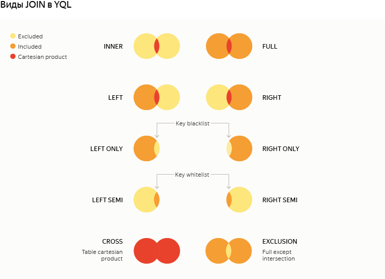

# JOIN

Позволяет объединить несколько источников данных (подзапросов или таблиц) по равенству значений указанных столбцов или выражений (ключей `JOIN`).

**Синтаксис**

``` sql
SELECT ...    FROM table_1
-- первый шаг объединения:
  <Join_Type> JOIN table_2 <Join_Condition>
  -- исходная выборка -- записи в таблице table_1
  -- присоединяемая выборка -- записи в таблице table_2
-- следующий шаг объединения:
  <Join_Type> JOIN table_n <Join_Condition>
  -- исходная выборка -- результат объединения на предыдущем шаге
  -- присоединяемая выборка -- записи в таблице table_n
-- могут быть следующие шаги объединения
...
WHERE  ...
```

На каждом шаге объединения по заданным правилам определяются соответствия между строками исходной и присоединяемой выборок данных, и формируется новая выборка, в которую попадают все сочетания подошедших под условия объединения строк. 



Так как колонки в YQL идентифицируются по именам, и в выборке не может быть двух колонок с одинаковыми именами, `SELECT * FROM ... JOIN ...` не может быть исполнен при наличии колонок с одинаковыми именами в объединяемых таблицах.




## Типы объединения (Join_Type)

* `INNER` <span style="color: gray;">(по умолчанию)</span> — Строки объединяемых выборок, для которых не найдено соответствие ни с одной строкой с другой стороны, не попадут в результат.
* `LEFT` - При отсутствии значения в присоединяемой выборке включает строку в результат со значениям колонок из исходной выборки, оставляя пустыми (`NULL`) колонки присоединяемой выборки
* `RIGHT` - При отсутствии значения в исходной выборке включает строку в результат со значениям колонок из присоединяемой выборки, оставляя пустыми (`NULL`) колонки исходной выборки
* `FULL` = `LEFT` + `RIGHT`
* `LEFT/RIGHT SEMI` — одна сторона выступает как белый список (whitelist) ключей, её значения недоступны. В результат включаются столбцы только из одной таблицы, декартового произведения не возникает;
* `LEFT/RIGHT ONLY` — вычитание множеств по ключам (blacklist). Практически эквивалентно добавлению условия `IS NULL` на ключ противоположной стороны в обычном `LEFT/RIGHT`, но, как и в `SEMI`, нет доступа к значениям;
* `CROSS` — декартово произведение двух таблиц целиком без указания ключевых колонок, секция с `ON/USING` явно не пишется;
* `EXCLUSION` — обе стороны минус пересечение.





`NULL` является особым значением, которое ничему не равно. Таким образом, `NULL` с двух сторон **НЕ** считаются равными друг другу. Это избавляет от неоднозначности в некоторых типах `JOIN`, а также от гигантского декартового произведения, которое часто возникает в противном случае.



## Условия объединения (Join_Condition)

Для `CROSS JOIN` условие объединения не указывается. В результат попадет декартово произведение исходной и присоединяемой выборкок, то есть сочетание всех со всеми. Количество строк в результирующей выборке будет произведением количества строк исходной и присоединяемой выборок.

Для любых других типов объединения необходимо указать условие одним из двух способов:

1. `USING (column_name)`. Используется при наличии в исходной и присоединяемой выборках одноименной колонки, равенство значений в которой является условием объединения.
2. `ON (equality_conditions)`. Позволяет задать условие равенства значений колонок или выражений над колонками исходной и присоединяемой выборок, или несколько таких условий, объединенных по `and`.

**Примеры:**
``` sql
SELECT    a.value as a_value, b.value as b_value
FROM      a_table AS a
FULL JOIN b_table AS b USING (key);
```

``` sql
SELECT    a.value as a_value, b.value as b_value
FROM      a_table AS a
FULL JOIN b_table AS b ON a.key = b.key;
```

``` sql
SELECT     a.value as a_value, b.value as b_value, c.column2
FROM       a_table AS a
CROSS JOIN b_table AS b
LEFT  JOIN c_table AS c ON c.ref = a.key and c.column1 = b.value;
```

