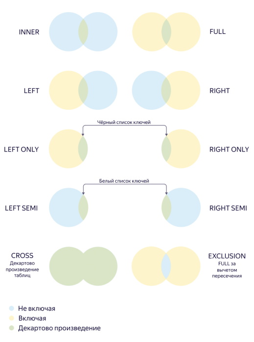

---

__system: {"dislikeVariants":["Нет ответа на мой вопрос","Рекомендации не помогли","Содержание не соответсвует заголовку","Другое"]}
---
# JOIN

Объединяет данные из двух источников (подзапросов или таблиц) по равенству значений указанных столбцов или выражений. 

`CROSS JOIN` строит декартово произведение: каждый элемент первого источника данных объединяется с каждым элементом второго источника данных. Условие, которое накладывается на результат декартова произведения, задается с помощью различных [типов `JOIN`](#join-types). По умолчанию используется `INNER JOIN`.

**Синтаксис**

Столбцы для `JOIN` задаются с помощью:

* `USING` — если имя столбцов совпадает во всех объединяемых таблицах. Подходит для простых запросов.

  **Пример**
  ```sql
  SELECT
    a.value, b.value
  FROM a_table AS a
  FULL JOIN b_table AS b
  USING (key);
  ```
* `ON` — если необходимо объединить таблицы по столбцам с разными именами. Позволяет строить более сложные запросы, включая запросы с условием [`WHERE`](select.md#where).

  **Пример**
  ```sql
  SELECT
    a.value, b.value
  FROM a_table AS a
  FULL JOIN b_table AS b
  ON a.key == b.key;
  ```


Если в выражении помимо `JOIN` выполняется фильтрация данных, рекомендуется обернуть те условия, про которые известно, что они вернут `true` для большинства строк, в вызов функции `LIKELY(...)`. Если предположение о преобладании истинных значений в условии окажется верным, запрос будет выполняться быстрее.



## Типы JOIN {#join-types}

В YQL доступны следующие логические типы JOIN:
* `INNER` (по умолчанию) — строки попадают в результат, только если значение ключевых столбцов присутствует в обеих таблицах. 
* `FULL`, `LEFT` и `RIGHT` — при отсутствии значения в обеих или в одной из таблиц строка будет включена в результат и заполнена `NULL`-значениями.
* `LEFT SEMI`/`RIGHT SEMI` — одна сторона выступает как белый список (whitelist) ключей, её значения недоступны. В результат включаются столбцы только из одной таблицы.
* `LEFT ONLY`/`RIGHT ONLY` — вычитание множеств по ключам (blacklist). Практически эквивалентно добавлению условия `IS NULL` на ключ противоположной стороны в обычном `LEFT`/`RIGHT`, но, как и в `SEMI`, нет доступа к значениям.
* `CROSS` — декартово произведение двух таблиц: каждая строка первой таблицы объединяется с каждой строкой второй таблицы. `ON`/`USING` явно не пишется.
* `EXCLUSION` — обе стороны минус пересечение.





`NULL` является особым значением, которое ничему не равно. Таким образом, `NULL` из двух источников не считаются равными, что избавляет от неоднозначности и ресурсоемких вычислений в некоторых типах `JOIN`.

